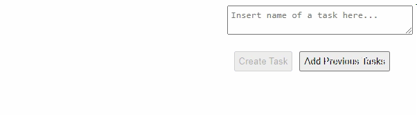

# ToDo-React-JS
> English not my first language

Simple React JS app to create a to-do list

## Table of contents
- [Introduction](#introduction)
- [Technologies](#technologies)
- [Illustrations](#illustrations)
- [To-Do](#to-do)

## Introduction
This project is a practice for introduction to diplay multiple JSX components using objects in arrays. It's a simple to-do list creator that tracks tasks, and also locks new tasks (If decided) if old tasks are not completed yet.

## Technologies
- NodeJS v15.8.0

## Illustrations

## To-Do
- Refactor of task-handling logic
- Auto-check Tasks (When loading saved tasks that were checked)